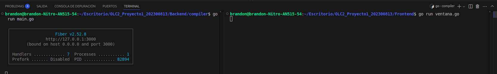
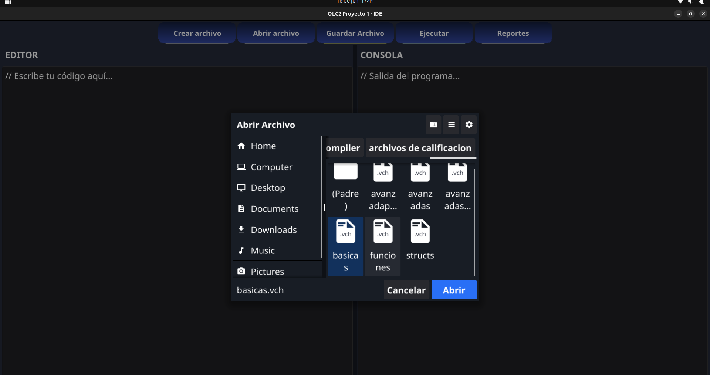
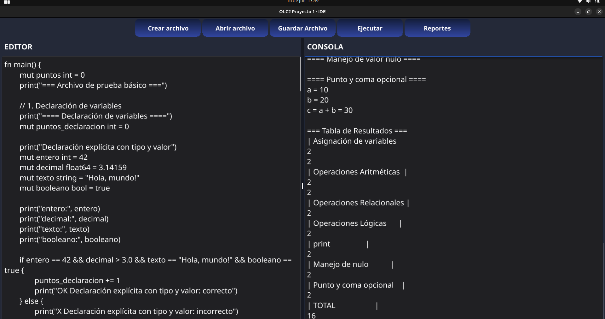
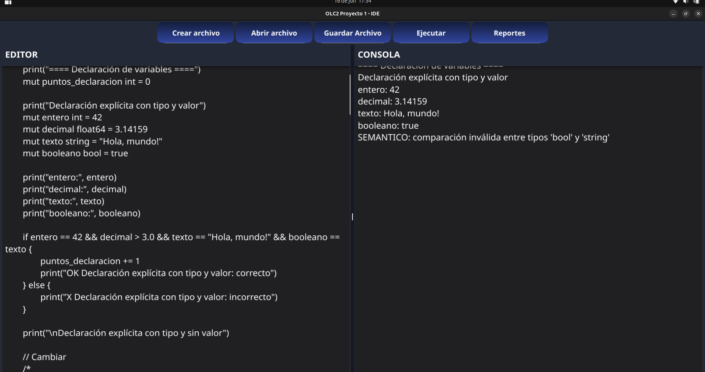
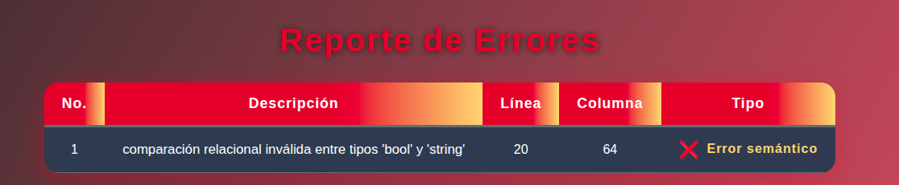
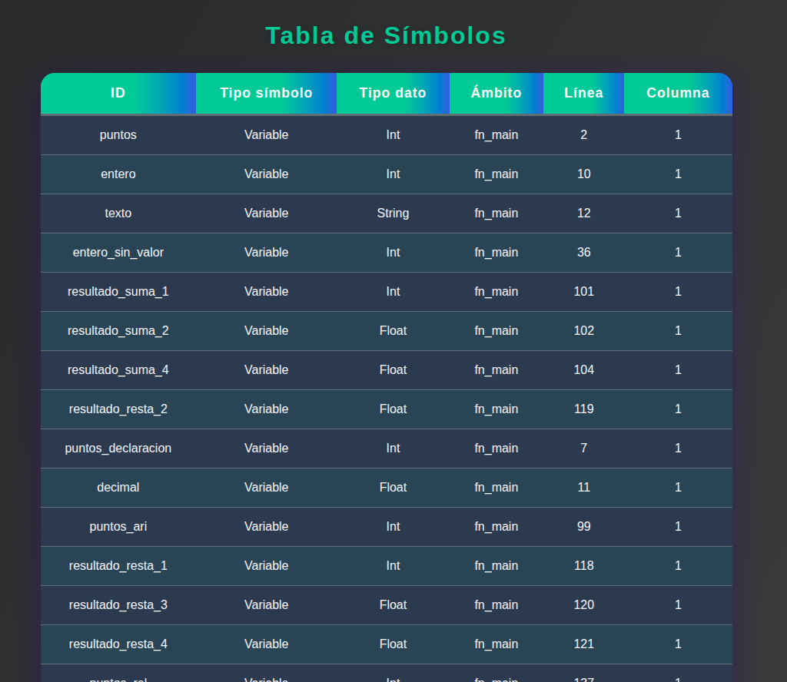
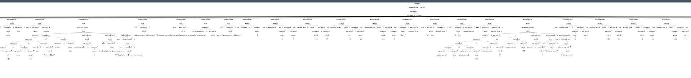
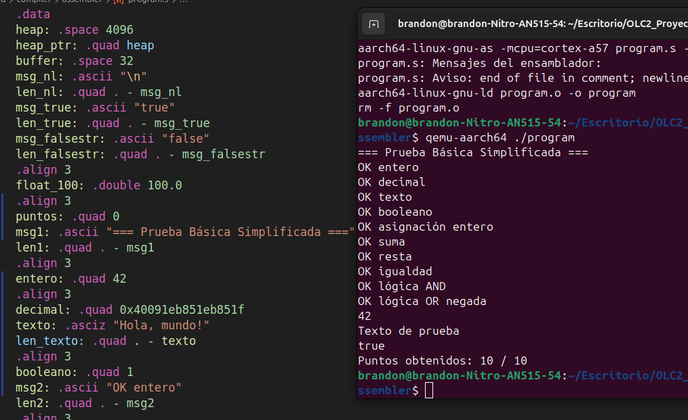

# Manual de Usuario - Intérprete V-lang Cherry

## Tabla de Contenidos
1. [Introducción](#introducción)
2. [Requisitos del Sistema](#requisitos-del-sistema)
3. [Instalación](#instalación)
4. [Descripción de la Interfaz](#descripción-de-la-interfaz)
5. [Funcionalidades](#funcionalidades)
6. [Reportes del Sistema](#reportes-del-sistema)
7. [Sintaxis Básica de V-lang Cherry](#sintaxis-básica-de-v-lang-cherry)
8. [Resolución de Problemas](#resolución-de-problemas)
9. [Preguntas Frecuentes](#preguntas-frecuentes)

---

## Introducción

El **Intérprete V-lang Cherry** es una aplicación de escritorio desarrollada con **Fyne** que permite escribir, editar y ejecutar código en el lenguaje V-lang Cherry. Esta aplicación nativa incluye un editor integrado con funcionalidades completas de análisis léxico, sintáctico y semántico, además de generar reportes detallados del proceso de compilación.

### Características principales:
- **Aplicación nativa de escritorio** desarrollada con Fyne
- Editor de código integrado con interfaz moderna
- Análisis léxico, sintáctico y semántico en tiempo real
- Generación automática del Árbol de Sintaxis Abstracta (AST)
- Sistema robusto de manejo de errores
- Reportes visuales detallados en ventanas nativas
- Consola de salida integrada

---

## Requisitos del Sistema

### Requisitos Mínimos:
- **Sistema Operativo:** Windows 10/11, macOS 10.14+, Linux (Ubuntu 18.04+)
- **Memoria RAM:** 4 GB mínimo, 8 GB recomendado
- **Espacio en disco:** 500 MB libres
- **Procesador:** x64 compatible

### Dependencias:
- Go 1.19 o superior
- ANTLR 4.x
- Fyne framework (incluido en el ejecutable)

---

## Instalación

### Para Windows:
1. **Descarga** el archivo `vlang-cherry-interpreter.exe` desde el repositorio oficial
2. **Ejecuta** el archivo directamente (no requiere instalación adicional)
3. **Verifica** que la aplicación se abra correctamente

### Para macOS:
1. **Descarga** el archivo `vlang-cherry-interpreter.app` 
2. **Arrastra** la aplicación a la carpeta Applications
3. **Ejecuta** la aplicación desde Launchpad o Applications
4. Si aparece un aviso de seguridad, ve a Preferencias del Sistema > Seguridad y Privacidad

### Para Linux:
1. **Descarga** el archivo `vlang-cherry-interpreter` (ejecutable)
2. **Dale permisos** de ejecución: `chmod +x vlang-cherry-interpreter`
3. **Ejecuta** el archivo desde terminal: `./vlang-cherry-interpreter`
4. **Alternativamente**, haz doble clic en el archivo desde el explorador

> **Nota:** La aplicación es completamente autónoma e incluye todas las dependencias necesarias.

---

## Descripción de la Interfaz

La aplicación de escritorio del intérprete está desarrollada con **Fyne**, proporcionando una interfaz nativa moderna y responsiva que se adapta al sistema operativo.

### Componentes Principales:

#### 📝 **Área de Edición (TextBox de Entrada)**
- **Ubicación:** Panel principal izquierdo
- **Función:** Editor de texto multilineal para escribir y editar código V-lang Cherry
- **Características:**
  - **Área de texto nativa** con soporte completo de teclado
  - **Scroll automático** para archivos largos
  - **Redimensionamiento dinámico** según el contenido
  - **Soporte para caracteres especiales** y UTF-8
  - **Indicador visual** del cursor y selección de texto

#### 📊 **Área de Salida (TextBox de Salida)**
- **Ubicación:** Panel principal derecho
- **Función:** Muestra los resultados de la ejecución del código en tiempo real
- **Características:**
  - **Solo lectura** para preservar la integridad de los resultados
  - **Auto-scroll** a la línea más reciente
  - **Formato preservado** para salidas estructuradas
  - **Limpieza automática** en cada nueva ejecución

#### 🔧 **Barra de Botones Nativa**
- **Diseño:** Botones nativos del sistema operativo
- **Distribución:** Horizontal en la parte superior o inferior de la ventana
- **Características:**
  - **Tooltips informativos** al pasar el mouse
  - **Estados visuales** (habilitado/deshabilitado)
  - **Iconos nativos** del sistema cuando están disponibles

### Ventajas de la Interfaz Fyne:
- ✅ **Rendimiento nativo** sin dependencias web
- ✅ **Apariencia consistente** con el sistema operativo
- ✅ **Uso eficiente de recursos** del sistema
- ✅ **Responsive design** que se adapta al tamaño de ventana
- ✅ **Soporte completo de teclado** y shortcuts

---

## Funcionalidades

### 🆕 **Crear Archivo**
**Descripción:** Limpia el área de edición para comenzar a escribir un nuevo archivo V-lang Cherry.

**Uso:**
1. Haz clic en el botón **"Crear Archivo"** (o usa Ctrl+N)
2. El área de edición se limpiará automáticamente
3. Un diálogo confirmará si hay cambios sin guardar
4. Comienza a escribir tu nuevo código

**Comportamiento:**
- Si hay código sin guardar, aparecerá una advertencia
- El título de la ventana cambiará a "Nuevo Archivo"
- El área de salida se limpiará también

**Casos de uso:**
- Iniciar un nuevo proyecto desde cero
- Crear archivos de prueba rápidos
- Limpiar el editor para empezar de nuevo

---

### 📂 **Abrir Archivo**
**Descripción:** Utiliza el diálogo nativo del sistema operativo para seleccionar y cargar archivos `.vch`.

**Uso:**
1. Haz clic en el botón **"Abrir Archivo"** (o usa Ctrl+O)
2. Se abrirá el **explorador de archivos nativo** del sistema
3. Navega hasta la ubicación del archivo deseado
4. Selecciona un archivo con extensión `.vch`
5. Haz clic en "Abrir"
6. El contenido se cargará inmediatamente en el área de edición

**Características del diálogo nativo:**
- **Windows:** Utiliza el File Dialog estándar de Windows
- **macOS:** Utiliza el NSOpenPanel nativo
- **Linux:** Utiliza el diálogo del entorno de escritorio

**Filtros de archivo:**
- Archivos V-lang Cherry (*.vch)
- Todos los archivos (*.*) - con advertencia

**Validaciones:**
- Verificación de que el archivo existe
- Comprobación de permisos de lectura
- Validación básica del contenido antes de cargar

**Manejo de errores:**
- Archivo no encontrado: Mensaje de error claro
- Sin permisos: Solicitud de ejecutar como administrador
- Archivo corrupto: Advertencia con opción de continuar

---

### 💾 **Guardar Archivo**
**Descripción:** Guarda el código actual del área de edición en un archivo con extensión `.vch`.

**Uso:**
1. Escribe o modifica tu código en el área de edición
2. Haz clic en el botón **"Guardar Archivo"**
3. Si es un archivo nuevo:
   - Se abrirá un diálogo para elegir ubicación y nombre
   - La extensión `.vch` se agregará automáticamente
4. Si es un archivo existente:
   - Se guardará automáticamente en la ubicación original

**Características:**
- Guardado automático de respaldo cada 5 minutos
- Preservación del formato y sangrado
- Validación básica antes del guardado

---

### ▶️ **Ejecutar**
**Descripción:** Inicia el proceso completo de análisis e interpretación del código V-lang Cherry.

**Proceso de ejecución:**
1. **Análisis Léxico:** Identificación y clasificación de tokens
2. **Análisis Sintáctico:** Validación de la estructura gramatical
3. **Análisis Semántico:** Verificación de reglas de coherencia
4. **Generación del AST:** Construcción del Árbol de Sintaxis Abstracta
5. **Interpretación:** Ejecución del código y generación de resultados

**Uso:**
1. Asegúrate de tener código en el área de edición
2. Haz clic en el botón **"Ejecutar"**
3. Observa la consola para ver el progreso
4. Los resultados aparecerán en el área de salida

**Estados posibles:**
- ✅ **Éxito:** El código se ejecutó correctamente
- ⚠️ **Advertencias:** El código se ejecutó con advertencias menores
- ❌ **Error:** Se encontraron errores que impiden la ejecución

---

### 📋 **Reportes**
**Descripción:** Abre ventanas nativas independientes que muestran reportes visuales detallados del proceso de análisis.

**Acceso a los reportes:**
1. Ejecuta tu código primero usando el botón "Ejecutar"
2. Haz clic en el botón **"Reportes"**
3. Se abrirá un **menú contextual nativo** o **ventana de selección**
4. Elige el tipo de reporte que deseas visualizar
5. Cada reporte se abrirá en su **propia ventana independiente**

**Tipos de reportes disponibles:**

#### 🌳 **Reporte del AST (Árbol de Sintaxis Abstracta)**
- **Presentación:** Ventana dedicada con representación textual estructurada
- **Características:**
  - **Estructura jerárquica** indentada para facilitar la lectura
  - **Información de nodos** (tipo, valor, hijos)
  - **Navegación por scroll** para árboles grandes
  - **Posibilidad de redimensionar** la ventana
- **Contenido:**
  - Nodos del árbol con sus relaciones padre-hijo
  - Tipos de datos y operaciones identificadas
  - Estructura completa del programa analizado

#### 🔍 **Tabla de Símbolos**
- **Presentación:** Ventana con formato de tabla nativa
- **Características:**
  - **Columnas organizadas:** Nombre, Tipo, Valor, Scope, Línea
  - **Filtrado por categoría:** Variables, Funciones, Parámetros
  - **Ordenamiento** por cualquier columna
  - **Búsqueda rápida** dentro de la tabla
- **Contenido detallado:**
  - Variables declaradas con su tipo de dato
  - Funciones y métodos con sus parámetros
  - Alcance (scope) donde fue declarado cada símbolo
  - Valores iniciales asignados
  - Número de línea donde se encuentra la declaración

#### ❌ **Tabla de Errores**
- **Presentación:** Ventana especializada para debugging
- **Características:**
  - **Categorización por tipo:** Léxico, Sintáctico, Semántico
  - **Códigos de error** estándar
  - **Navegación directa** al error (si se implementa)
  - **Exportación** de la lista de errores
- **Información detallada:**
  - **Número de línea y columna** exacta del error
  - **Tipo de error** claramente identificado
  - **Descripción detallada** del problema
  - **Sugerencias de corrección** cuando es posible
  - **Contexto del código** donde ocurrió el error

#### 🎯 **Tabla de Tokens**
- **Presentación:** Ventana con listado completo de tokens
- **Características:**
  - **Vista tabular** con información completa de cada token
  - **Resaltado por tipo** de token (keywords, identificadores, operadores)
  - **Posicionamiento preciso** en el código fuente
  - **Filtrado por tipo** de token
- **Datos mostrados:**
  - **Tipo de token** (IDENTIFIER, KEYWORD, OPERATOR, etc.)
  - **Valor literal** del token
  - **Posición exacta** (línea y columna)
  - **Categoría léxica** correspondiente

### Ventajas de las ventanas nativas:
- ✅ **Independientes:** Cada reporte en su propia ventana
- ✅ **Redimensionables:** Ajusta el tamaño según necesites
- ✅ **Copiables:** Selecciona y copia información específica
- ✅ **Simultáneas:** Abre múltiples reportes al mismo tiempo
- ✅ **Persistentes:** Mantienen la información hasta que se cierren

---

## Reportes del Sistema

### Consola Integrada
La aplicación incluye un área de consola nativa que muestra información en tiempo real:

**Tipos de mensajes:**
- **Notificaciones del sistema** (inicio, fin de ejecución)
- **Mensajes de estado** del proceso de análisis
- **Advertencias** durante la compilación
- **Salida estándar** del programa (println, print)
- **Mensajes de error** con detalles técnicos

**Características nativas:**
- **Auto-scroll** a los mensajes más recientes
- **Selección de texto** para copiar mensajes específicos
- **Limpieza automática** en cada nueva ejecución
- **Formato preservado** para salidas estructuradas
- **Timestamps** opcionales para debugging

### Códigos de Color y Estados:
- 🟢 **Verde:** Operaciones exitosas, ejecución completada
- 🟡 **Amarillo:** Advertencias, sugerencias de optimización
- 🔴 **Rojo:** Errores críticos, fallos de compilación
- 🔵 **Azul:** Información general, mensajes del sistema
- ⚪ **Normal:** Salida estándar del programa ejecutado

### Ventajas de la implementación Fyne:
- ✅ **Rendimiento nativo** sin lag en la interfaz
- ✅ **Integración completa** con el sistema operativo
- ✅ **Shortcuts de teclado** estándar (Ctrl+C, Ctrl+V, etc.)
- ✅ **Menús contextuales** nativos del SO
- ✅ **DPI scaling** automático para pantallas de alta resolución

---

## Sintaxis Básica de V-lang Cherry

### Estructura de un Programa
```vlang
// Comentario de línea
/* Comentario de bloque */

// Declaración de variables
mut nombre := "Usuario"
edad := 25

// Función principal
fn main() {
    println("Hola, mundo!")
    println("Edad: ${edad}")
}
```

### Tipos de Datos Soportados
- **Enteros:** `int`, `i32`, `i64`
- **Decimales:** `f32`, `f64`
- **Cadenas:** `string`
- **Booleanos:** `bool`
- **Arreglos:** `[]tipo`

### Estructuras de Control
```vlang
// Condicionales
if edad >= 18 {
    println("Mayor de edad")
} else {
    println("Menor de edad")
}

// Bucles
for i in 0..10 {
    println(i)
}
```

---

## Resolución de Problemas

### Problemas Comunes:

#### El programa no ejecuta
**Posibles causas:**
- Errores de sintaxis en el código
- Archivo no guardado correctamente
- Falta de función `main()`

**Soluciones:**
- Revisa la tabla de errores
- Verifica la sintaxis
- Asegúrate de tener una función principal

#### Errores de compilación
**Síntomas:**
- Mensajes de error en rojo en la consola
- El programa no produce salida

**Soluciones:**
- Consulta el reporte de errores detallado
- Verifica la declaración de variables
- Revisa el uso correcto de tipos de datos

#### La aplicación se cierra inesperadamente
**Posibles causas:**
- Código con bucles infinitos o recursión excesiva
- Memoria insuficiente del sistema
- Archivos muy grandes que superan los límites

**Soluciones:**
- Reinicia la aplicación
- Verifica el código por bucles infinitos
- Reduce el tamaño del archivo o divide en módulos menores
- Cierra otras aplicaciones para liberar memoria

#### Los botones no responden
**Síntomas:**
- Clicks en botones no generan acción
- La interfaz parece "congelada"

**Soluciones:**
- Espera a que termine el proceso actual (especialmente ejecución)
- Usa shortcuts de teclado como alternativa (Ctrl+O, Ctrl+S, etc.)
- Reinicia la aplicación si persiste el problema

#### Los reportes no se abren
**Posibles causas:**
- No se ha ejecutado código previamente
- Errores graves que impiden la generación de reportes
- Problemas con la creación de ventanas nuevas

**Soluciones:**
- Ejecuta el código exitosamente primero
- Verifica que no haya errores críticos
- Verifica permisos del sistema para crear ventanas

### Códigos de Error Comunes:
| Código | Descripción | Solución |
|--------|-------------|----------|
| LEX001 | Token no reconocido | Verifica caracteres especiales |
| SYN002 | Error de sintaxis | Revisa estructura del código |
| SEM003 | Variable no declarada | Declara la variable antes de usarla |
| SEM004 | Tipo incompatible | Verifica tipos en asignaciones |

---

## Preguntas Frecuentes

### ❓ **¿Qué extensión debo usar para mis archivos?**
Utiliza la extensión `.vch` para todos los archivos de V-lang Cherry.

### ❓ **¿Puedo redimensionar la ventana de la aplicación?**
Sí, la aplicación Fyne es completamente redimensionable. Arrastra los bordes o esquinas para ajustar el tamaño según tus necesidades.

### ❓ **¿Funcionan los shortcuts de teclado estándar?**
Sí, la aplicación soporta shortcuts estándar como:
- **Ctrl+N:** Crear archivo nuevo
- **Ctrl+O:** Abrir archivo 
- **Ctrl+S:** Guardar archivo
- **Ctrl+C/V:** Copiar y pegar en el editor

### ❓ **¿Puedo tener múltiples ventanas de reportes abiertas?**
Sí, cada reporte se abre en su propia ventana independiente y puedes tener múltiples reportes abiertos simultáneamente.

### ❓ **¿La aplicación guarda configuraciones?**
La aplicación recuerda configuraciones básicas como el tamaño de ventana y la última ubicación de archivos abiertos.

### ❓ **¿Qué hago si la aplicación no inicia?**
Verifica que tengas permisos de ejecución y que tu sistema operativo sea compatible. En Linux, asegúrate de que el archivo tenga permisos ejecutables.

---

# FLUJO DE LAS FUNCIONALIDADES DEL SISTEMA

- como primer punto levantamos el backend como el frontend a la vez


- Luego de eso procedera a mostrarse el frontend,donde veremos unos botones antes explicados, sin embargo, el que nos importa ahora es el de abri archivo, donde nos mostrara un explorador y es donde procederemos a buscar un archivo.vch


- Luego se vera como se cargara el texto de dicho archivo al frontend donde ahora lo que sigue es darle al boton de ejecutar para empezar el proceso, *nos mostrara una salida*


- Ahora podemos comprobar que la salida es la correcta por lo que ha sido todo un exito, si ponemos algo como comparar un bool y un string seria un error semantico



- ahora vemos la tabla de simbolos


- ahora el arbol, aunque si esta algo grande


- ademas de eso se crea un archivo.S en el cual crea un archivo en codigo assembler donde uno lo puede ejecutar (se cargo otro archivo debido a que esta es la fase 2 del proyecto)
